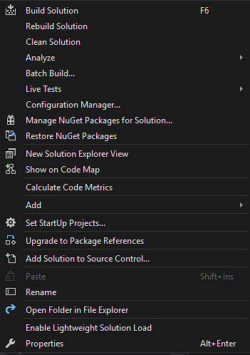
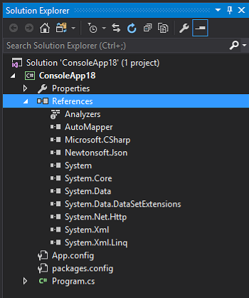

# NuGet Package to Project.json Converter

Download this extension from the [VS Gallery](https://visualstudiogallery.msdn.microsoft.com/8e8e8c73-e874-4180-9a44-1c9ebffd308d) or the [CI build](http://vsixgallery.com/extension/NuGetPackageConfigConverter.Taylor%20Southwick.dd0141da-d26f-4013-8b78-72723a313486/).

---------------------------------------

This will convert projects that are using NuGet dependencies via `packages.config` or `project.json` to the newer `PackageReference` format. There are many benefits
to using this new format even in non-.NET Core projects (where it is required). Some of them include:

- Transitive dependencies are automatically included - you only need to include the dependencies you need
- install.ps1/uninstal.ps1 is not run so arbitrary code is not run on install and uninstall from untrusted packages
- Doesn't rewrite your project file
- Doesn't add extra files to the project

In order to run, right-click the Solution in `Solution Exporer` and click `Upgrade to Package References`: 

After selecting that, the project will be transformed as shown below. It is highly recommended that you perform this on a source-control enabled
directory so you can easily undo if something goes wrong.

|  Before                                   | After                                   |
|-------------------------------------------|-----------------------------------------|
|  |  |

Please file any issues if something does not work as expected.

## License
[Apache 2.0](LICENSE)